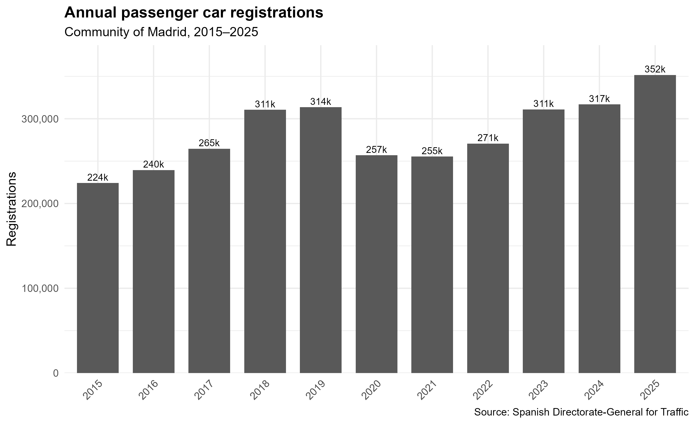
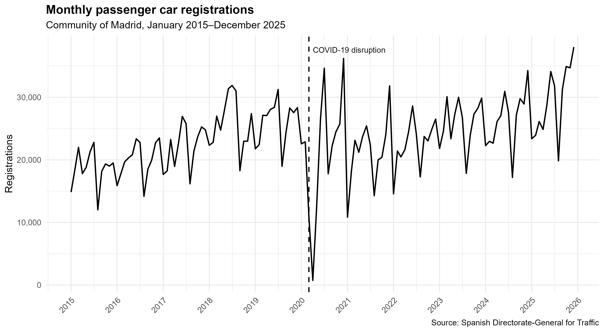
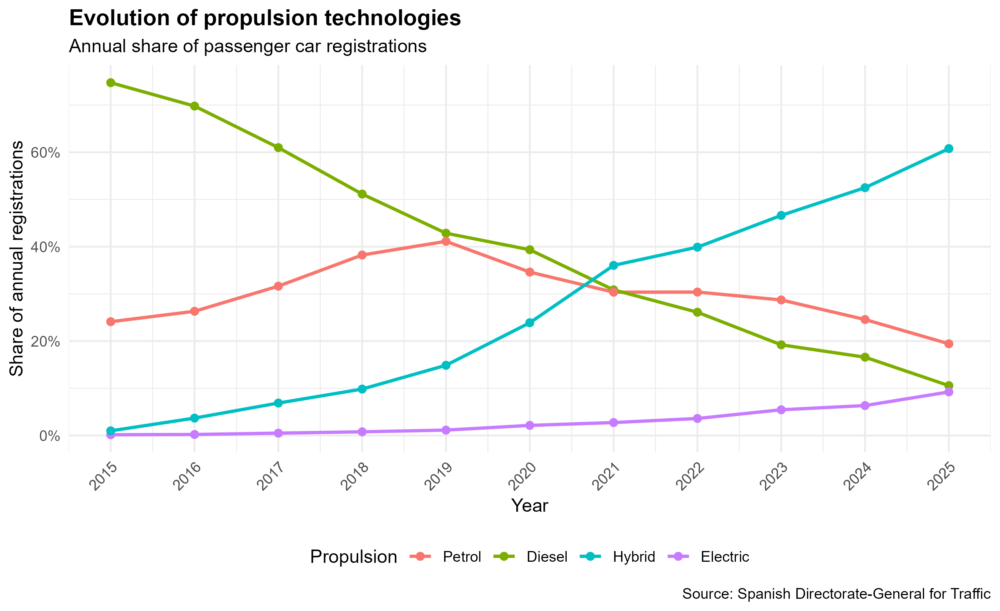
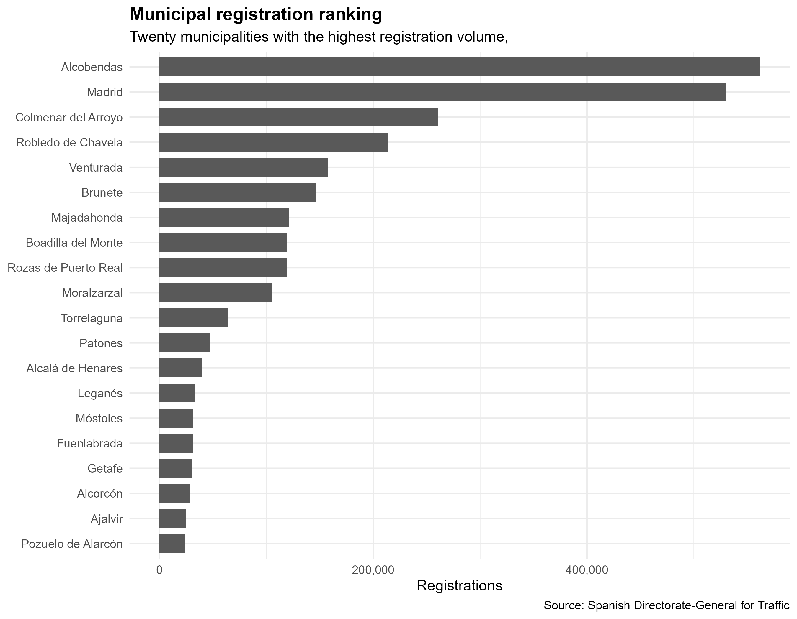
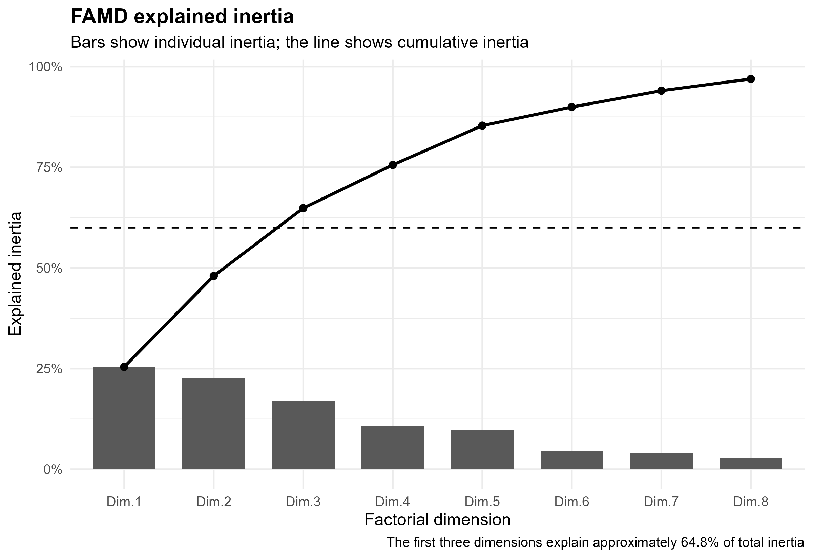
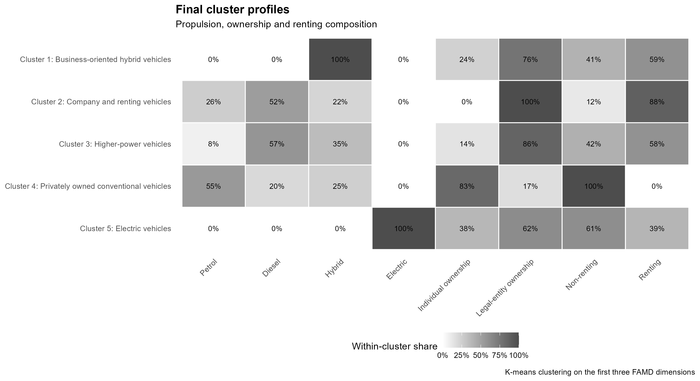

# Executive Summary

## Passenger Car Registrations in the Community of Madrid, 2015–2025

**Author:** Miguel Moscardó

## Project objective

This project analyses the evolution and structure of new passenger car
registrations in the Community of Madrid between January 2015 and December
2025.

The study combines descriptive, territorial, multivariate and time-series
methods to identify changes in vehicle characteristics, propulsion
technologies, ownership patterns and municipal registration activity.

## Data

The original source consists of monthly fixed-width files published by the
Spanish Directorate-General for Traffic.

After importing, validating and filtering the records, the final analytical
dataset contains:

- **3,115,063 valid new passenger car registrations**
- **132 monthly periods**
- **11 complete years, from 2015 to 2025**

The original files and the processed microdata are excluded from the public
repository because of their size and redistribution constraints.

Small aggregated outputs are available in
[`data/public/`](../data/public/).

## Methodology

The analytical workflow includes:

1. Import and conversion of monthly fixed-width files.
2. Data cleaning and validation.
3. Selection of valid new passenger car registrations.
4. Descriptive analysis of vehicle characteristics and propulsion.
5. Territorial analysis by municipality.
6. Factor Analysis of Mixed Data.
7. K-means clustering on factorial coordinates.
8. Monthly time-series analysis and STL decomposition.

## Main findings

### Registration evolution

The monthly and annual series reveal a clear disruption in 2020, followed by a
gradual recovery. The data also display recurring seasonal variation across
calendar months.





### Propulsion transition

The composition of registrations changes substantially during the study
period. Conventional diesel loses relative importance, while hybrid and
electric technologies become increasingly relevant.



### Territorial concentration

Registration activity is strongly concentrated in a limited number of
municipalities.

The results reflect several different territorial dynamics:

- Madrid city as the region's main urban centre.
- Municipalities associated with corporate fleets and renting activity.
- Peripheral municipalities with atypically high registration volumes.
- The remaining municipalities with lower and more conventional activity.



### Multivariate structure

The FAMD uses five quantitative and three qualitative active variables.

The final complete-case analytical sample contains **3,041,569 observations**,
equivalent to approximately **97.64%** of the master dataset.

The first three factorial dimensions explain approximately **64.8%** of the
total inertia and are used as input for the cluster analysis.



### Vehicle profiles

The final K-means solution contains five clusters:

| Cluster | Observations | Share | Main profile |
|---:|---:|---:|---|
| 1 | 165,153 | 5.43% | Business-oriented hybrid vehicles |
| 2 | 1,343,425 | 44.17% | Company and renting vehicles |
| 3 | 482,263 | 15.86% | Higher-power vehicles |
| 4 | 954,647 | 31.39% | Privately owned conventional vehicles |
| 5 | 96,081 | 3.16% | Electric vehicles |

The clustering solution explains approximately **71.6%** of the variation in
the retained factorial space. Repeated estimation with different random seeds
produced the same within-cluster sum of squares, supporting the stability of
the final solution.



## Reproducibility

The repository contains:

- Modular R scripts for each analytical stage.
- Centralised paths and parameters.
- Relative file paths.
- Fixed random seeds.
- A safe project execution controller.
- Public aggregated CSV files.
- Reproducible figures generated without access to the microdata.

The analytical workflow can be inspected with:

```r
source("R/99_run_project.R")
run_project()